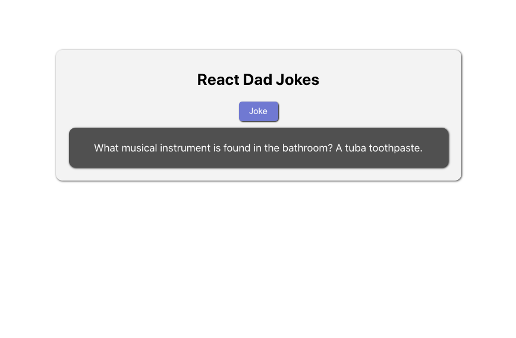
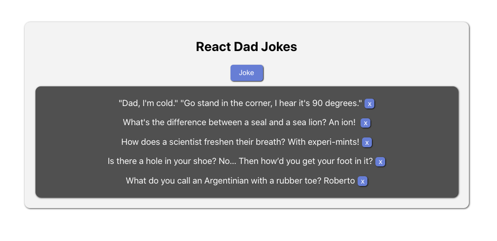

# React-Ajax Dad Jokes!

Second in class exercise in the introduction to React for DigitalCrafts Immersive students.

## This App Will...
- [ ] shows header
- [ ] show a button
- [ ] shows a container for jokes
- [ ] makes ajax request to dad joke api
- [ ] adds joke to state
- [ ] maps over array of dad jokes
- [ ] maybe grab a dad joke on page load

## Screenshot
v1

v2
